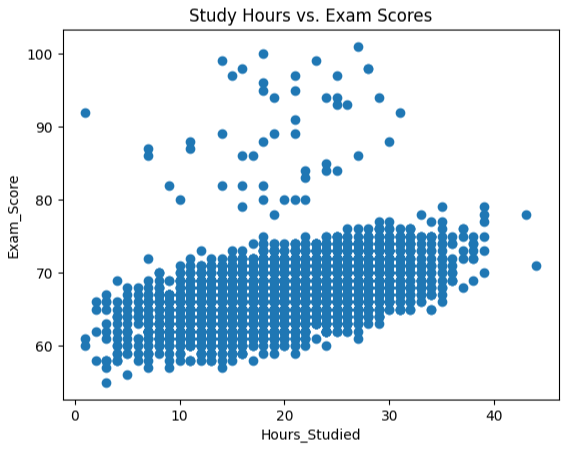
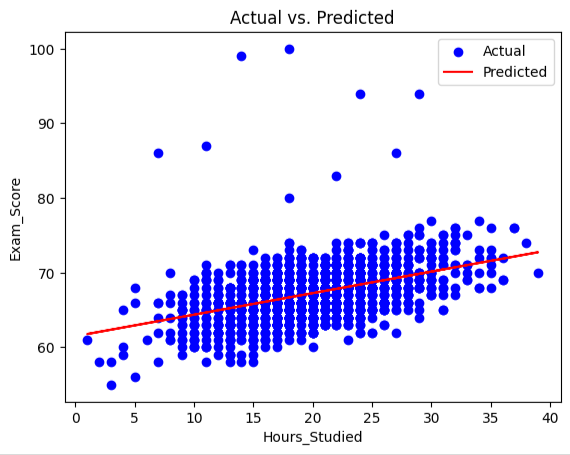
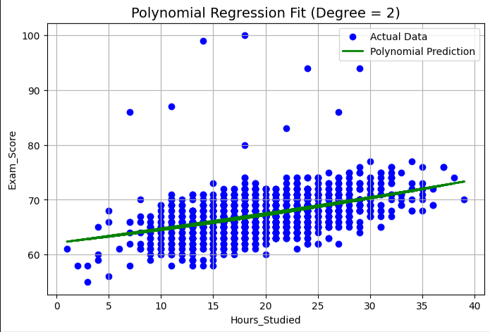

# Student-Score-Prediction
I'm doing a 1 month ML Internship with **Elevvo Pathways**. The is Level 1 : Task 1 which involves predicting student exam scores based on study hours, using linear and polynomial regression techniques.

# 📌 Project Overview
- **Goal:** Predict exam scores using regression models.
- **Dataset:** Student Performance Factors (Kaggle)
- **Models Used:** Linear Regression, Polynomial Regression
- **Bonus:** Tested feature combinations like sleep hours & participation.

# 📊 Dataset
Source: https://www.kaggle.com/datasets/lainguyn123/student-performance-factors
Number of Records: 6,607
Number of Features: 20
File Format: CSV

# 🧠 Tools & Libraries
- Python
- Pandas, NumPy
- Matplotlib
- Scikit-learn (LinearRegression, PolynomialFeatures, model evaluation tools)

# Results
------------------------------------------
| Model                 | MAE   | RMSE   |
|-----------------------|-------|--------|
| Linear Regression     | 2.529 | 0.2051 |
| Polynomial Regression | 2.528 | 0.2050 |
------------------------------------------

# Visualizations
              
